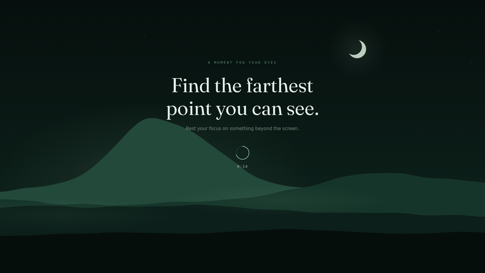
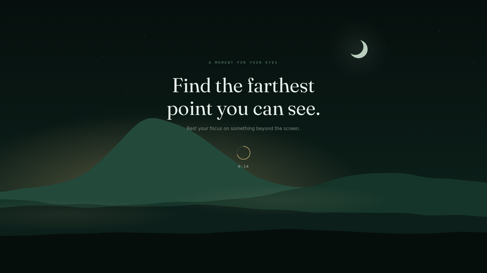

# Unfocus

[](https://github.com/abhiksark/unfocus/actions/workflows/ci.yml)
[](https://github.com/abhiksark/unfocus/releases)
[](LICENSE)
[](#platform-status)
[](https://v2.tauri.app)

A break reminder that asks one thing of you: look at something far away.

[Releases](https://github.com/abhiksark/unfocus/releases) ·
[Changelog](CHANGELOG.md) ·
[Report a bug](https://github.com/abhiksark/unfocus/issues/new?template=bug_report.yml) ·
[Request a feature](https://github.com/abhiksark/unfocus/issues/new?template=feature_request.yml) ·
[Security](https://github.com/abhiksark/unfocus/security/policy)



By default, every twenty minutes Unfocus covers every monitor with a quiet
night scene and counts down twenty seconds while your eyes rest on the farthest
point you can find. You can change both durations from the dashboard. When the
scene warms to amber, dawn is rising behind the ridge and the break is almost
over. No streaks, no badges, no mascot asking to be watched. The whole point is
that you stop looking at the screen.

## Download the alpha

Download the current alpha from [GitHub Releases](https://github.com/abhiksark/unfocus/releases)
and choose the package for your system:

On macOS, install the same prerelease through the public Homebrew tap:

```sh
brew install --cask abhiksark/unfocus/unfocus@alpha
```

| Platform | Choose | Status and first-run notes |
| --- | --- | --- |
| Linux X11 | `.deb` for Debian or Ubuntu, `.rpm` for Fedora or RHEL, or `.AppImage` for a portable build | Qualified; Wayland is unsupported |
| Windows x64 | Setup `.exe` for a normal install or `.msi` for managed installation | Early build; idle and fullscreen probes are unavailable |
| macOS Apple silicon | `aarch64.dmg` | Preview; right-click the app and choose **Open** on first launch |
| macOS Intel | `x64.dmg` | Preview; right-click the app and choose **Open** on first launch |

These early builds are not code-signed or notarized. Download only from the
official releases page, read the release notes, and verify packages with the
accompanying `SHA256SUMS` file and GitHub build-provenance attestations.
Unfocus does not update itself yet, so check the releases page for new builds.

## How it works

- Covers every monitor with a synchronized full-screen break, rendered as a
  generated landscape that moves too slowly to be worth watching
- Signals state through light: cool green while you rest, amber dawn when it
  is time to come back
- Ends early without a fight: press Escape or select **End break**
- Lets you choose a 1–120 minute work interval and a 3–30 second break from
  the dashboard, storing those settings only on your device
- Uses idle and fullscreen signals, where supported, to avoid interrupting
  you when you are already away from the desk or presenting
- Keeps the reminder timer running when a platform probe fails instead of
  crashing, guessing, or silently disabling future breaks
- Runs local-first: no account, telemetry, cloud dependency, or packaged-app
  network calls

Timing defaults to a twenty-minute work interval and twenty-second break.
Saving a change during work starts a new work countdown immediately; a break
already on screen keeps its original duration and the saved timing applies to
the next work phase.



## Platform status

Unfocus is in early development. Platform labels describe tested behavior,
not just whether a package can be produced.

| Platform | Status | Current behavior |
| --- | --- | --- |
| Linux X11 | Qualified | Tray, synchronized multi-monitor overlays, XScreenSaver idle detection, and EWMH fullscreen detection |
| macOS | Preview | Quartz idle and fullscreen probes work interactively; multi-monitor behavior has not completed an acceptance run |
| Windows | Early build | Packages are produced; idle and fullscreen probes report as unavailable |
| Linux Wayland | Unsupported | No Wayland probes or acceptance coverage |

On launch, the dashboard shows the live platform signals Unfocus can read.
Closing the dashboard leaves the reminder running in the system tray; the tray
menu can reopen it or quit the app. Starting Unfocus again reveals that same
dashboard instead of creating another tray or reminder timer. Where probes are
supported, a due break stays hidden when you are already idle or the active
window is fullscreen.


## Build from source

Install the [Tauri prerequisites](https://v2.tauri.app/start/prerequisites/)
for your platform—the listed system libraries on Linux or the Xcode command
line tools on macOS—plus the Bun and Rust versions declared in `.bun-version`
and `rust-toolchain.toml`, then:

```sh
bun install --frozen-lockfile
bun run tauri dev
```

On an X11 machine without the native headers installed, the container runner
builds and runs against your real display and session bus:

```sh
./scripts/run-linux-spike-container.sh
```

That runner is a development convenience, not a sandbox. Run it only from a
revision you trust. It can access the host X11 display and session bus. The
repository is mounted read-only except for ignored `src-tauri/target` and
`src-tauri/gen` build directories, which are bind-mounted read-write. The
frontend build also runs on the host before the container starts.

## Contributing

`main` is the protected release branch and the GitHub default branch, while
normal development integrates on `dev`. Start a short-lived `feature/*`,
`fix/*`, `docs/*`, `chore/*`, or `refactor/*` branch from current `dev` and
open its pull request back into `dev`. Releasable batches are promoted from
`dev` to `main`; ordinary work does not target `main` directly.

Before sending application changes, run the local application gate:

```sh
bun run test
bun run check
bun run build
cargo fmt --check --manifest-path src-tauri/Cargo.toml
cargo clippy --manifest-path src-tauri/Cargo.toml --all-targets --all-features --locked -- -D warnings
cargo test --manifest-path src-tauri/Cargo.toml --all-targets --all-features --locked
```

Version, toolchain, dependency, notice, SBOM, and generated-asset changes have
additional named gates in `package.json`. CI enforces the complete set.

## Build and release integrity

CI runs on every push to `main` or `dev`, every pull request, and a weekly
schedule. It checks version and toolchain agreement, frontend tests and static
analysis, production builds, dependency policy, generated notices and SBOMs,
Rust formatting, clippy with warnings denied, Rust tests, and macOS and Windows
compilation. The `Required CI` check fails unless every required job passes.

Releases are cut by tagging a commit already contained in `main`. The tag must
be `v` followed by the complete declared version, such as
`v0.1.0-alpha.1`. The workflow reruns the quality gate before packaging,
isolates release credentials from build jobs, and prepares a draft prerelease
with checksums, build-provenance attestations, a CycloneDX SBOM, and third-party
notices. Published releases are never overwritten.

Prerelease labels remain in artifact filenames so candidate and final builds
cannot collide. The Windows MSI's internal ProductVersion is the one exception:
Windows requires a numeric-only value, so `0.1.0-alpha.1` is represented there
as `0.1.0`.

## Privacy and security

Unfocus has no accounts, telemetry, cloud dependency, or packaged-app runtime
network calls. Report a suspected vulnerability privately through the
[security policy](.github/SECURITY.md), not in a public issue.

## Design

The break screen is designed to lose a staring contest. The landscape is
generated once by `scripts/gen-scene.js` and baked into a single SVG; motion
is confined to a few slow, stepped layers, so the scene feels alive without
inviting attention, and every animation stops under `prefers-reduced-motion`.
If you change the scene, edit the generator and regenerate rather than
touching the SVG by hand.

## License

- Unfocus source code: [MIT](LICENSE)
- Vendored Fraunces font: [SIL Open Font License 1.1](static/fonts/OFL.txt)
- Dependency license texts and notices: bundled with every package and tracked
  in [THIRD_PARTY_NOTICES.txt](THIRD_PARTY_NOTICES.txt)
