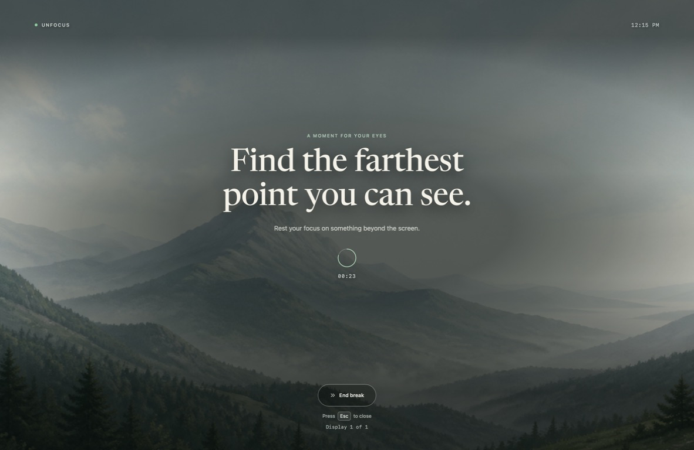
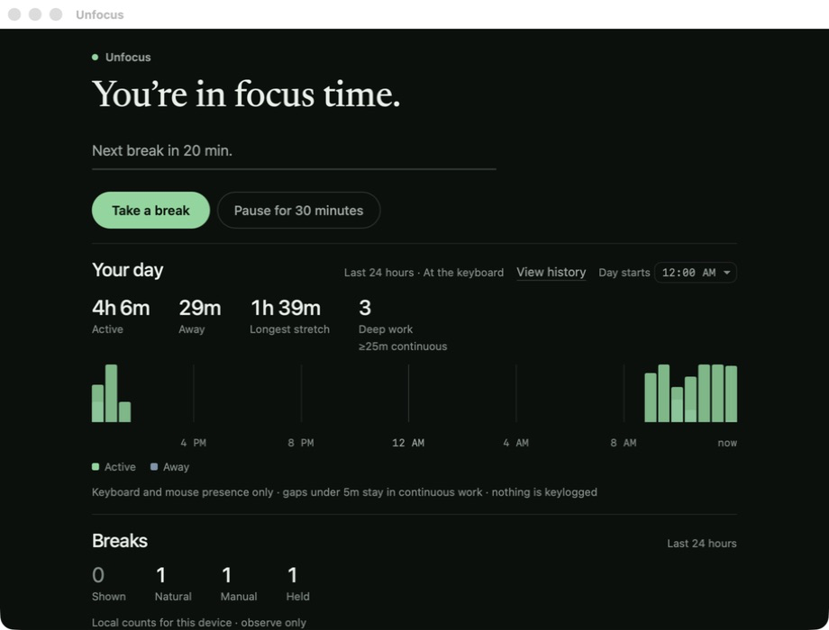
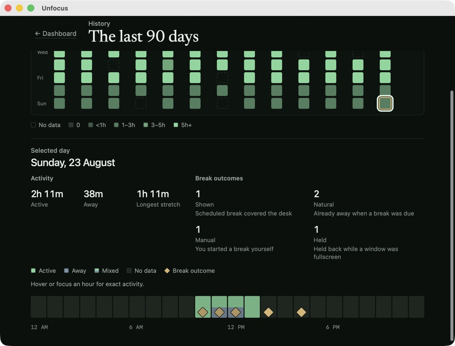

# Unfocus

[](https://github.com/abhiksark/unfocus/actions/workflows/ci.yml)
[](https://github.com/abhiksark/unfocus/releases)
[](LICENSE)
[](#platform-status)
[](https://v2.tauri.app)

A local-first **break** and **reflection** app: it asks you to look far away when
it is time to rest, and it shows a calm picture of how your day went.

[Releases](https://github.com/abhiksark/unfocus/releases) ·
[Install guide](docs/install.md) ·
[Changelog](CHANGELOG.md) ·
[Report a bug](https://github.com/abhiksark/unfocus/issues/new?template=bug_report.yml) ·
[Request a feature](https://github.com/abhiksark/unfocus/issues/new?template=feature_request.yml) ·
[Security](https://github.com/abhiksark/unfocus/security/policy)



**Break.** By default, every twenty minutes Unfocus covers every monitor with a
quiet, static distant landscape, colored for the device's local time, and
counts down twenty seconds while your eyes rest on the farthest point you can
find. You can change both durations from the dashboard. When localized light
warms the lower valley to amber, the break is almost over.

**Reflection.** The same dashboard keeps a local **Your day** view: continuous
presence at the keyboard versus time away, deep stretches, and calm counts of
how breaks were taken or held. It is presence only (no keylogging), observe
only (it never skips or advances the timer for you), and stored only on this
device.

No streaks, no badges, no mascot asking to be watched. The whole point of a
break is that you stop looking at the screen. The whole point of the day view
is that you can see the rhythm without turning it into a score.

## Download the alpha

**Step-by-step install for each OS and package type:** [docs/install.md](docs/install.md)
(verify downloads, first run, tray notes, uninstall, troubleshooting).

### Ubuntu / Debian (X11): preferred Linux path

On **Ubuntu** (and other Debian-based systems) with an **X11** session, install
the alpha from the public APT repository at [apt.abhik.ai](https://apt.abhik.ai).
The suite is signed with the Unfocus archive OpenPGP key; `apt update` verifies
that signature before trusting package lists. Optional detached `.deb.asc`
signatures are published next to each pool package for offline checks.

```sh
curl -fsSL https://apt.abhik.ai/public-key.asc \
  | sudo gpg --dearmor -o /usr/share/keyrings/unfocus-archive-keyring.gpg
echo 'deb [arch=amd64 signed-by=/usr/share/keyrings/unfocus-archive-keyring.gpg] https://apt.abhik.ai alpha main' \
  | sudo tee /etc/apt/sources.list.d/unfocus-alpha.list
sudo apt update
sudo apt install unfocus
```

Use an X11 session (`echo $XDG_SESSION_TYPE` should print `x11`). On Ubuntu
GNOME, pick **Ubuntu on Xorg** at login if needed. Wayland is unsupported.
Enable the **Ubuntu AppIndicators** extension if the tray icon is missing.

Upgrade with `sudo apt update && sudo apt install --only-upgrade unfocus`.
Full notes (remove the source, offline `.deb.asc` verify, tray, and X11) are
in the [install guide](docs/install.md#debian--ubuntu-apt-preferred).

### Other platforms

Download packages from [GitHub Releases](https://github.com/abhiksark/unfocus/releases),
or on macOS use the public Homebrew tap:

```sh
brew install --cask abhiksark/unfocus/unfocus@alpha
```

| Platform | Choose | Status and first-run notes |
| --- | --- | --- |
| **Ubuntu / Debian X11** | **APT** (`apt install unfocus`) preferred; also `.deb` from releases | **Qualified** on Linux X11; packages signed via the APT archive OpenPGP key |
| Other Linux X11 | `.deb`, `.rpm`, or `.AppImage` from releases | Qualified backend; verify `SHA256SUMS`; Wayland unsupported |
| Windows x64 | Setup `.exe` or `.msi` | Early build; not application code-signed; SmartScreen may warn |
| macOS Apple silicon | `aarch64.dmg` or Homebrew | Preview; not notarized; right-click → **Open** on first launch |
| macOS Intel | `x64.dmg` or Homebrew | Preview; not notarized; right-click → **Open** on first launch |

**Signing today:** Ubuntu/Debian APT packages use the archive OpenPGP key on
[apt.abhik.ai](https://apt.abhik.ai) (normal third-party repo model). macOS and
Windows installers are not application code-signed or notarized. For release
assets from GitHub, verify `SHA256SUMS` and optional build-provenance
attestations. Unfocus does not auto-update; use `apt upgrade`, `brew upgrade`,
or a newer release package.

## How it works

### Breaks

- Covers every monitor with a synchronized full-screen break over a bundled,
  first-party landscape that stays still while you look beyond the screen
- Signals state through light: cool green while you rest, amber dawn when it
  is time to come back
- Ends early without a fight: press Escape or select **End break**
- Lets you choose a 1–120 minute work interval and a 3–30 second break from
  the dashboard, storing those settings only on your device
- Lets you pause reminders for thirty minutes, resume into a fresh work
  interval, or start the configured break immediately from the dashboard or
  tray; a pause keeps only its bounded local expiry across restarts
- Uses idle and fullscreen signals, where supported, to avoid interrupting
  you when you are already away from the desk or presenting
- May credit a due break as a natural rest when you have already been idle long
  enough, or hold the overlay for fullscreen, without rewriting the pure clock
- Keeps the reminder timer running when a platform probe fails instead of
  crashing, guessing, or silently disabling future breaks

Timing defaults to a twenty-minute work interval and twenty-second break.
Saving a change during work starts a new work countdown immediately; a break
already on screen keeps its original duration and the saved timing applies to
the next work phase.

#### Optional cross-device timing

Cross-device timing is off by default, so the existing relative timer is
unchanged unless you opt in. When enabled, each device independently uses the
same wall-clock grid—without accounts, pairing, networking, communication, or
one device acting as a coordinator.

Set the same work and break durations on every device. Unfocus captures the
device's UTC offset when you enable sync; after travel or another offset change,
turn sync off and on again to capture the new offset. Compare the dashboard's
break-time preview on each device to confirm that their upcoming points align.

Resuming reminders rejoins the shared grid. Starting a manual break does not
postpone the next scheduled grid point.

### Reflection (Your day)

Where the idle probe is available, a **Your day** summary on the consumer
dashboard shows a rolling last-24-hour view of continuous computer use versus
time away from the keyboard:



- Presence only: keyboard and mouse idle signals, never keylogging
- Gaps under five minutes stay inside continuous work; stretches of at least
  twenty-five minutes of continuous activity are counted as deep blocks
- A half-hour strip sketches the day at a glance, with calm empty or
  probe-unavailable states when samples are missing
- History exposes the newest 90 local days as a compact Monday-aligned
  calendar whose fixed intensity levels represent confirmed active minutes.
  Selecting a day reveals its hourly activity and break outcomes; boundaries
  follow the saved **Day starts** preference
- Local break-outcome counts (shown, natural rest, manual rest, held for
  fullscreen) for the last day, with a quieter seven-day total
- Local archive chunks retain presence history for at least 90 days. Because
  whole 30-day chunks expire together, an older partial chunk can remain until
  its complete 30-day block expires
- Compatible existing local data is preserved, but activity from before
  History was installed cannot be backfilled
- Observe-only: it does not pause, skip, or advance the break timer



Scheduled break presentation may use that same local presence history so a long
continuous stretch requires a real away period before natural credit, while a
long AFK still prefers a quiet natural rest when you remain idle. Fullscreen
still suppresses the overlay.

### Local and private

- Runs local-first: no account, telemetry, cloud dependency, or packaged-app
  network calls
- Timing, day history, and break outcomes stay on this device
- Only explicit activation of the linked author name asks the system browser to
  open the fixed `https://abhik.ai` address; Unfocus makes no
  application-originated runtime network call
- Expand **Advanced** in the timing editor and select **Open developer mode**
  for live platform signals, monitor coordinates, raw probe errors, and manual
  refresh; the selected consumer or developer view is remembered locally

## Platform status

Unfocus is in early development. Platform labels describe tested behavior,
not just whether a package can be produced.

| Platform | Status | Current behavior |
| --- | --- | --- |
| Linux X11 (Ubuntu primary) | Qualified | Preferred install on Ubuntu/Debian via signed APT at [apt.abhik.ai](https://apt.abhik.ai). AppIndicator tray where the desktop provides a host, synchronized multi-monitor overlays, XScreenSaver idle detection, and EWMH fullscreen detection |
| macOS | Preview | Quartz idle and fullscreen probes work interactively. While running, Unfocus is intentionally tray/menu-bar-only (no Dock icon or application menu); reopen or focus the dashboard from its tray icon. Physical multi-monitor acceptance has not completed. |
| Windows | Early build | Packages are produced; `GetLastInputInfo` idle and foreground-monitor fullscreen probes are implemented. Interactive multi-monitor qualification is still pending |
| Linux Wayland | Unsupported | Default packages have no Wayland probes. An opt-in `wayland-sway` developer feature scaffolds a Sway 1.11+ candidate only; it is not qualified and must not be described as supported |

Closing the dashboard leaves the reminder running in the system tray. Where a
tray is available, its menu shows the current work countdown or break phase and
can pause or resume reminders, start the configured break immediately, preview
a break without changing the timer, reopen the dashboard, or quit the app.
Starting Unfocus again reveals that same dashboard instead of creating another
tray or reminder timer. Where probes are supported, a due break stays hidden
when you are already idle or the active window is fullscreen.

On macOS, Unfocus intentionally uses Accessory activation while it runs: it is
available from the tray/menu-bar icon, without a Dock icon or application menu.
Use that tray icon to reopen or focus the dashboard. macOS remains Preview;
physical multi-monitor acceptance is still unfinished.

On Linux, the desktop must provide a StatusNotifier/AppIndicator host; Ubuntu
GNOME normally does this through its Ubuntu AppIndicators extension. The locked
Tauri tray API can report construction failure, but it cannot confirm that a
panel chose to display a successfully constructed indicator. If the icon is
missing, keep the dashboard open, enable or restart the desktop's indicator
host, and restart Unfocus. A known setup error appears in the dashboard, and
closing that dashboard exits instead of hiding an unreachable process.

## Build from source

End users should prefer a [release package](docs/install.md). To develop or
build from source, install the
[Tauri prerequisites](https://v2.tauri.app/start/prerequisites/) for your
platform (the listed system libraries on Linux or the Xcode command line tools
on macOS) plus the Bun and Rust versions declared in `.bun-version` and
`rust-toolchain.toml`, then:

```sh
bun install --frozen-lockfile
bun run tauri dev
```

On an X11 machine without the native headers installed, the container runner
builds and runs against your real display and session bus:

```sh
./scripts/run-linux-spike-container.sh
```

That runner is a development convenience, not a sandbox. Run it only from a
revision you trust. It can access the host X11 display and session bus. The
repository is mounted read-only except for ignored `src-tauri/target` and
`src-tauri/gen` build directories, which are bind-mounted read-write. The
frontend build also runs on the host before the container starts. A private
temporary runtime directory gives libappindicator a writable icon path and is
removed when the runner exits.

## Contributing

`main` is the protected release branch and the GitHub default branch, while
normal development integrates on `dev`. Start a short-lived `feature/*`,
`fix/*`, `docs/*`, `chore/*`, or `refactor/*` branch from current `dev` and
open its pull request back into `dev`. Releasable batches are promoted from
`dev` to `main`; ordinary work does not target `main` directly.

Before sending application changes, run the local application gate:

```sh
bun run test
bun run check
bun run build
cargo fmt --check --manifest-path src-tauri/Cargo.toml
cargo clippy --manifest-path src-tauri/Cargo.toml --all-targets --all-features --locked -- -D warnings
cargo test --manifest-path src-tauri/Cargo.toml --all-targets --all-features --locked
```

Version, toolchain, dependency, notice, SBOM, and generated-asset changes have
additional named gates in `package.json`. CI enforces the complete set.

## Build and release integrity

CI runs on every push to `main` or `dev`, every pull request, and a weekly
schedule. It checks version and toolchain agreement, frontend tests and static
analysis, production builds, dependency policy, generated notices and SBOMs,
Rust formatting, clippy with warnings denied, Rust tests, and macOS and Windows
compilation. The `Required CI` check fails unless every required job passes.

Releases are cut by tagging a commit already contained in `main`. The tag must
be `v` followed by the complete declared version, such as
`v0.5.0-alpha.1`. The workflow reruns the quality gate before packaging,
isolates release credentials from build jobs, and prepares a draft prerelease
with checksums, build-provenance attestations, a CycloneDX SBOM, and third-party
notices. Published releases are never overwritten.

Prerelease labels remain in artifact filenames so candidate and final builds
cannot collide. The Windows MSI's internal ProductVersion is the one exception:
Windows requires a numeric-only value, so `0.5.0-alpha.1` is represented there
as `0.5.0`.

Debian packages also retain the canonical SemVer in their filename. Their
embedded `Version` uses Debian ordering, so `0.5.0-alpha.1` becomes
`0.5.0~alpha.1-1` and upgrades normally through later candidates to the stable
package.

## Privacy and security

Unfocus has no accounts, telemetry, cloud dependency, or packaged-app runtime
network calls. Day history and break outcomes stay on the device next to other
local settings. Report a suspected vulnerability privately through the
[security policy](.github/SECURITY.md), not in a public issue.

## Design

The break screen is designed to lose a staring contest. It keeps the words,
countdown, veil, and returning light on a centered reading axis so the next
instruction is easy to find without making the whole scene visually
symmetrical.

### Composition

The bundled, first-party matte landscape keeps its asymmetric summit around
the left `38.2%` golden line. The horizon and the center of the return light sit
around the lower `61.8%` line, while the functional interface remains centered
on every viewport. Supporting light and contrast fields use smooth `61.8:38.2`
ellipses rather than drawing a literal golden-ratio ornament.

Legibility and crop safety take priority over the grid. On narrower,
portrait-like, or short displays, the composition preserves the centered copy
and keeps the summit in frame; nonessential guidance can yield before the
countdown or exit control does. The exit control retains at least a 44 px
target in the most constrained layout.

### Typography

Typography separates reflection from operation instead of applying one brand
face everywhere:

| Role | Typeface | Used for |
| --- | --- | --- |
| Reflective display | Newsreader 1.003, weight 450, automatic optical sizing | The consumer state heading, History page heading, and break message |
| Interface | Native system sans-serif | Body copy, labels, guidance, navigation, and controls; developer mode also keeps its heading in this role |
| Timing and evidence | Native system monospace with tabular numbers | Clocks, countdowns, timeline and event times, timing inputs, display labels, monitor geometry, and diagnostic values |

Newsreader is a locally vendored variable font, preloaded with the application
and reserved for those reflective headings. Interface copy therefore follows
the conventions of the host operating system, while changing digits and
technical values remain stable and easy to compare.

### Light, motion, and accessibility

At the shared start of a break, device-local time selects one cool-biased
lighting treatment: dawn from 05:00 to 09:00, day from 09:00 to 17:00, dusk
from 17:00 to 21:00, or night from 21:00 to 05:00. That choice is held across
every connected monitor for the complete break, so synchronized overlays do
not shift palette midway through a run. It needs neither location permission
nor a network lookup.

The artwork and selected local-time veil stay still. The only scene-state
change is a localized amber return light that fades in once during the final
moments and remains through completion. There is no continuous full-viewport
animation. With reduced motion enabled, entrance motion is removed and the
return and dismissal fades are shortened to 120 ms. Increased contrast uses a
stronger dark veil, brighter text, and reinforced control states across the
supported crops.

### Local assets and provenance

The retained first-party
[artwork source](scripts/asset-sources/break-scene-source.png) and its
[deterministic provenance](scripts/asset-sources/break-scene.provenance.json)
live beside the font records under `scripts/asset-sources/`. The bundled JPEG
is a 4K delivery derivative, not a native-4K source. Newsreader is likewise
pinned to version 1.003 with its upstream commit, asset and license hashes, and
normalization recorded in the
[font provenance](scripts/asset-sources/newsreader.provenance.json).

Both the scene and font ship inside the app: there is no runtime font download,
asset CDN, or scene network request. The font's OFL identity is also carried in
the generated third-party notices and release SBOM.

## License

- Unfocus source code and first-party break-scene artwork, including the
  [retained source](scripts/asset-sources/break-scene-source.png) and bundled
  delivery derivative: [MIT](LICENSE)
  ([provenance](scripts/asset-sources/break-scene.provenance.json))
- Vendored Newsreader font: [SIL Open Font License 1.1](static/fonts/OFL.txt)
- Dependency license texts and notices: bundled with every package and tracked
  in [THIRD_PARTY_NOTICES.txt](THIRD_PARTY_NOTICES.txt)
